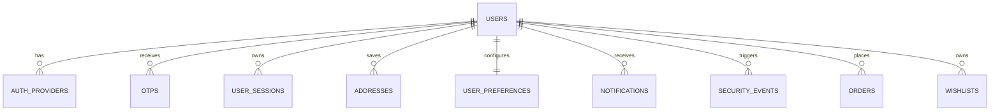

<!-- Governed by .rules v1.0 -->

# Enterprise Auth And Profile Audit

Project: Cruisin luxury ecommerce platform  
Scope: Authentication, profile, account, session, notification, security, and ecommerce-readiness audit  
Status: Audit and architecture design only. Implementation is not started in this document.

## Executive Summary

Cruisin currently has a strong ecommerce foundation: Next.js storefront, Next.js admin, Express API, MongoDB models, Redis-backed refresh token storage, role middleware, Zod validation, Cloudinary upload signing, payment provider abstractions, and seeded catalog/admin data.

The current auth/account system is usable for an early production MVP, but it is not yet enterprise-grade. It supports email/password login, register, refresh, logout, email verification, forgot/reset password, profile update, password change, address add/remove, account deletion, wishlist, and order history. It does not yet support Google OAuth, WhatsApp OTP, mobile OTP, account linking, device/session management, notification center, security center, advanced profile fields, login history, fraud signals, or customer-grade preferences.

Security score: 68 / 100  
Ecommerce readiness score for account/auth domain: 62 / 100  
Production readiness score for enterprise identity: 55 / 100

## Phase 1: Architecture Audit

### Frontend

Framework: Next.js 15 App Router with React 19 and TypeScript.  
Routing: Storefront routes live under `client/app/(shop)` and auth under `client/app/(auth)`. Admin routes live under `admin/app/(dashboard)` and `admin/app/login`.  
State management: Zustand for auth/cart/wishlist and React Query for remote data.  
UI libraries: Tailwind CSS, Framer Motion, Radix packages, lucide-react, Recharts in admin.  
Authentication flow: Email/password login calls `/api/v1/auth/login`, stores access token in localStorage, relies on httpOnly cookie refresh token from backend.  
User pages: Account profile, addresses, orders, order detail, wishlist, login/register/forgot/reset are present.

Strengths:
- Clear separation between storefront, admin, and backend.
- React Query is already used for async data.
- Central `lib/api.ts` axios instance exists.
- Pages have loading/error siblings.
- Account and auth routes already exist.

Weaknesses:
- Access token is stored in localStorage, increasing impact of XSS.
- Auth state is not fully rehydrated from `/auth/me` on storefront boot.
- No first-class session/device management UI.
- Account dashboard is basic and not yet marketplace-grade.
- No Google/OTP/WhatsApp auth UI.
- No notification center or security center.

Scalability issues:
- Client auth state is simple and does not model multiple providers, sessions, login factors, or verification states.
- Address management is embedded in the user document instead of being a first-class collection.
- Wishlist lacks alert preferences and event hooks.

### Backend

Framework: Express 5 with TypeScript.  
API architecture: `/api/v1` route prefix, controllers/services/middleware split.  
Middleware: auth, admin, validation, rate limit, upload, error handler, mongo sanitize.  
Authentication: JWT access tokens, refresh tokens in httpOnly cookies and Redis hashed keys.  
Validation: Zod validators exist across major resources.  
Services: Auth, cart, product, order, payment, CMS, wishlist, coupon, review, user, upload.

Strengths:
- Bcrypt rounds 12 are used.
- JWT secrets are Zod-validated for minimum length.
- Refresh tokens are hashed in Redis.
- Auth routes are rate limited.
- Helmet and CORS allowlist are configured.
- Global error middleware exists.
- Service layer avoids direct controller DB logic.

Weaknesses:
- Refresh token rotation is incomplete; refresh issues a new access token but does not rotate refresh tokens.
- `refreshTokenHash` also exists on user, duplicating Redis truth and not supporting multiple sessions.
- No CSRF protection despite cookie-based refresh.
- No OTP subsystem.
- No social identity provider table.
- No login history, active sessions, device tracking, IP/location tracking, or suspicious login detection.
- No account lockout or credential stuffing defense beyond rate limiting.

### Database

Current core user schema:
- `User`: name, email, passwordHash, role, avatar, phone, embedded addresses, isVerified, isActive, refreshTokenHash.
- `Wishlist`: user with products array.
- `Order`: includes user/session, items, addresses, payments, totals, timeline.
- `Notification` model exists but is not wired into a customer notification center.

Strengths:
- User email is unique and indexed.
- Roles and active flags are indexed.
- Product/order/cart/coupon/review schemas are in place.

Weaknesses:
- Embedded addresses limit independent lifecycle, validation, analytics, and indexing.
- No provider identities collection.
- No OTP collection.
- No user session collection.
- No notification preference schema.
- No soft-delete metadata such as `deletedAt`.
- No `lastLogin`, `status`, gender, DOB, WhatsApp number, or separate verification states.

### Security

Strengths:
- Password hashing with bcrypt 12.
- JWT access/refresh secrets validated.
- Refresh token hashes stored in Redis.
- httpOnly cookie is used for refresh token.
- CORS allowlist and Helmet are present.
- Mongoose sanitization middleware exists.

Security issues:
- Access token in localStorage.
- No CSRF token on refresh/logout or state-changing cookie-auth routes.
- No refresh rotation/reuse detection.
- No device/session table.
- No login alerts or suspicious login detection.
- No OTP anti-abuse model.
- No account linking conflict resolution.
- No provider unlink safety rules.

### Deployment

Deployment artifacts exist:
- `vercel.json`
- `render.yaml`
- `DEPLOYMENT.md`
- `.env.example`

Weaknesses:
- No Docker Compose for local Mongo/Redis/API/client/admin orchestration.
- No CI pipeline detected in repo audit.
- No migration framework.
- No automated security tests.
- No load/performance testing harness.

## Phase 2: Authentication Audit

Security score: 68 / 100

| File | Problem | Impact | Recommendation |
| --- | --- | --- | --- |
| `client/store/authStore.ts` | Auth store does not persist or rehydrate from `/auth/me`. | Refresh or tab reload can leave UI unaware of a valid cookie session. | Add bootstrap query, guarded routes, and silent refresh flow. |
| `client/hooks/useAuth.ts` | Access token stored in localStorage. | XSS can steal bearer token. | Prefer memory-held access token plus refresh cookie, or hardened httpOnly access cookie with CSRF. |
| `server/src/services/auth.service.ts` | Refresh endpoint does not rotate refresh tokens. | Stolen refresh token remains usable until expiry. | Implement refresh token rotation, family id, reuse detection, and session revocation. |
| `server/src/services/auth.service.ts` | User has single `refreshTokenHash` plus Redis keys. | Conflicting session model; cannot manage devices. | Move refresh tracking to `user_sessions`. |
| `server/src/middleware/auth.middleware.ts` | Auth only supports bearer access token. | No consistent cookie/session strategy across web apps. | Standardize on short access token plus refresh rotation and CSRF-protected cookie refresh. |
| `server/src/routes/v1/auth.routes.ts` | No Google/phone/WhatsApp provider routes. | Missing required login methods. | Add provider and OTP route groups. |
| `server/src/models/user.model.ts` | No social identity/provider mapping. | Cannot link Google, email, phone, WhatsApp to one account. | Add `auth_providers` collection. |
| `server/src/models/user.model.ts` | No status enum or deletedAt. | Weak account lifecycle and auditability. | Add status, deletedAt, lastLogin, verification states. |
| `server/src/services/auth.service.ts` | Forgot/reset tokens are stored raw-keyed in Redis. | Acceptable but lacks audit trail and device alerts. | Store hashed reset identifiers with event logging. |
| `server/src/app.ts` | No CSRF middleware. | Cookie-auth state changes are exposed to CSRF risk. | Add double-submit or signed CSRF token for browser clients. |

## Phase 3: Profile System Audit

Current implemented features:
- Profile update for name/email/phone/avatar backend field.
- Password change backend hook.
- Address add/remove.
- Order history/detail.
- Wishlist view/toggle.
- Account deletion.

Missing ecommerce features:
- Account dashboard summary.
- Avatar upload UI through signed Cloudinary.
- Gender and date of birth.
- WhatsApp number.
- Separate phone/email/WhatsApp verification states.
- Address edit and set-default API.
- Address validation and geolocation.
- Reward points/membership state.
- Recently viewed summary.
- Notification center.
- Security center.
- Active sessions and device history.
- Connected accounts UI.
- Wishlist price-drop and stock alerts.

Poor UX patterns:
- Profile page is a plain form, not a dashboard.
- Address system is not a first-class address book.
- Security actions are scattered or absent.
- No visible session expiry or device controls.
- No preference management.

Missing APIs:
- `GET /auth/providers`
- `POST /auth/google/start`
- `POST /auth/google/callback`
- `POST /auth/otp/request`
- `POST /auth/otp/verify`
- `GET /account/dashboard`
- `GET/PATCH /profile`
- Full CRUD `/addresses`
- `GET/DELETE /sessions`
- `GET/PATCH /preferences`
- `GET/PATCH /notifications`
- `GET /security/events`

## Phase 4: Industry Gap Analysis

| Feature | Current State | Industry Standard | Recommendation | Priority |
| --- | --- | --- | --- | --- |
| Email/password auth | Implemented | Strong password policy, verification, reset, history | Keep and add login history/account lockout | P0 |
| Google OAuth | Missing | OAuth 2.0, One Tap, account linking | Add Google provider service and linking flow | P0 |
| Mobile OTP | Missing | SMS OTP with cooldown, attempts, fraud checks | Add OTP service, Twilio provider, rate limits | P0 |
| WhatsApp OTP | Missing | WhatsApp API with fallback SMS | Add WhatsApp provider abstraction | P1 |
| Account linking | Missing | One account with many identities | Add auth providers table and conflict flow | P0 |
| Sessions | Redis refresh keys only | Device-level sessions with revoke/logout all | Add `user_sessions` collection | P0 |
| Profile | Basic | Rich editable profile and verification badges | Add advanced profile fields and verification | P1 |
| Address book | Embedded add/remove | CRUD, default, validation, geolocation | Move to address collection | P0 |
| Wishlist | Basic product save | Move-to-cart, alerts, sharing | Add alert subscriptions | P2 |
| Notifications | Model exists only | Read/unread center and channels | Add notification APIs and preferences | P1 |
| Security center | Missing | Connected accounts, sessions, events | Add full security center | P0 |
| Order tracking | Basic timeline | Invoices, returns, shipment tracking | Extend order center | P1 |
| Fraud prevention | Minimal | Abuse detection and throttles | Add risk signals and event logs | P1 |

## Phase 5: New Authentication Architecture

### Identity Model

One `users` record represents the customer. All login identities attach through `auth_providers`.

Supported providers:
- `email`
- `google`
- `phone`
- `whatsapp`

Account linking rules:
- If provider identity is new and user is authenticated, link to current user after OTP/OAuth verification.
- If provider identity exists and belongs to current user, treat as idempotent success.
- If provider identity exists and belongs to another user, block linking and require support-grade merge flow.
- If unauthenticated login provider returns verified email/phone matching an existing user, require step-up verification before linking.
- Never auto-merge accounts solely by unverified phone/email.

### Login Flows

Google OAuth:
- Admin creates Google OAuth client IDs for web/mobile.
- Frontend requests Google credential or OAuth code.
- Backend verifies credential with Google.
- Backend checks `auth_providers(provider='google', provider_user_id=sub)`.
- If found, creates session.
- If not found but verified email exists, require account linking verification.
- If no user exists, create user and provider record.

WhatsApp OTP:
- User enters WhatsApp number.
- Backend normalizes E.164 number.
- Backend rate-limits by IP, phone, device fingerprint, and account.
- Backend stores OTP hash with purpose and expiry.
- Twilio/Meta provider sends OTP.
- Verify endpoint checks hash, attempts, expiry, and risk rules.
- Successful verification creates/links provider and session.

Mobile SMS OTP:
- Same OTP service with `channel='sms'`.
- Resend cooldown.
- Attempt cap.
- Abuse scoring.

Email/password:
- Keep current flow.
- Add login events, lastLogin, failed attempt tracking, and optional MFA/OTP step-up for risk.

## Phase 6: Database Redesign

### Proposed Collections

`users`
- id
- name
- email
- phone
- whatsappNumber
- avatar
- gender
- dateOfBirth
- role
- status: active, suspended, pending_verification, deleted
- isVerified
- emailVerifiedAt
- phoneVerifiedAt
- whatsappVerifiedAt
- lastLogin
- createdAt
- updatedAt
- deletedAt

`auth_providers`
- id
- userId
- provider: email, google, phone, whatsapp
- providerUserId
- providerEmail
- providerPhone
- isVerified
- linkedAt
- createdAt
- updatedAt

`otps`
- id
- userId
- phone
- channel: sms, whatsapp
- otpHash
- purpose: login, link_account, verify_phone, reset_password
- attempts
- maxAttempts
- expiresAt
- verifiedAt
- ipAddress
- deviceFingerprint
- createdAt

`user_sessions`
- id
- userId
- sessionFamilyId
- deviceName
- browser
- os
- ipAddress
- location
- userAgent
- lastActive
- refreshTokenHash
- revokedAt
- createdAt
- expiresAt

`addresses`
- id
- userId
- type: home, office, other
- fullName
- phone
- country
- state
- city
- pincode
- street
- landmark
- latitude
- longitude
- isDefault
- createdAt
- updatedAt

`user_preferences`
- userId
- language
- currency
- theme
- marketingEmails
- pushNotifications
- smsNotifications
- whatsappNotifications
- createdAt
- updatedAt

`notifications`
- id
- userId
- title
- message
- type: order, promotion, security, system
- isRead
- channel
- metadata
- createdAt

`security_events`
- id
- userId
- type
- ipAddress
- location
- deviceName
- riskScore
- metadata
- createdAt

### ER Diagram

### Index Strategy

Users:
- unique `{ email: 1 }` where email exists
- unique `{ phone: 1 }` sparse
- unique `{ whatsappNumber: 1 }` sparse
- `{ status: 1, role: 1 }`
- `{ deletedAt: 1 }`

Auth providers:
- unique `{ provider: 1, providerUserId: 1 }`
- unique `{ provider: 1, providerEmail: 1 }` sparse
- unique `{ provider: 1, providerPhone: 1 }` sparse
- `{ userId: 1 }`

OTPs:
- `{ phone: 1, purpose: 1, createdAt: -1 }`
- TTL `{ expiresAt: 1 }`
- `{ ipAddress: 1, createdAt: -1 }`

Sessions:
- `{ userId: 1, expiresAt: 1 }`
- unique `{ refreshTokenHash: 1 }`
- `{ sessionFamilyId: 1 }`
- TTL `{ expiresAt: 1 }`

Addresses:
- `{ userId: 1, isDefault: 1 }`
- `{ userId: 1, updatedAt: -1 }`

Notifications:
- `{ userId: 1, isRead: 1, createdAt: -1 }`

Security events:
- `{ userId: 1, createdAt: -1 }`
- `{ ipAddress: 1, createdAt: -1 }`

### Migration Plan

1. Add new collections without removing current user fields.
2. Backfill `auth_providers` with `email` provider for every existing user.
3. Backfill `addresses` from embedded `user.addresses`.
4. Backfill `user_preferences` defaults.
5. Add session creation to login while keeping Redis refresh compatibility.
6. Move refresh validation to `user_sessions`.
7. Release profile/address APIs using new collections.
8. Remove embedded address writes after frontend migration.
9. Remove user `refreshTokenHash` after all sessions migrate.
10. Add data retention jobs for OTPs, revoked sessions, and security events.

## Phase 7: Enterprise Profile UX Specification

Account dashboard:
- Avatar, name, membership tier, verification badges.
- Recent orders with status and tracking.
- Wishlist count and price-drop alerts.
- Saved address summary.
- Reward points.
- Recently viewed products.
- Security alerts.

Profile:
- Avatar upload via signed Cloudinary operation.
- Name, gender, DOB, email, phone, WhatsApp number.
- Verification status per contact method.
- Step-up verification for email/phone changes.

Address book:
- Add, edit, delete, default.
- Address type: home, office, other.
- Pincode/city/state validation.
- Delivery availability check.
- Optional geolocation.

Order center:
- Tabs for pending, delivered, cancelled, returned.
- Invoice download.
- Tracking number and timeline.
- Return/refund initiation hooks.

Wishlist:
- Save/remove.
- Move to cart.
- Price drop alerts.
- Back-in-stock alerts.
- Optional shareable list.

Notification center:
- Order updates.
- Promotions.
- Security alerts.
- System notifications.
- Read/unread filtering.
- Channel preference links.

Security center:
- Connected accounts: Google, email, phone, WhatsApp.
- Link/unlink flows.
- Change password.
- Active sessions.
- Logout other devices.
- Device history.
- Security event log.

## Phase 8: Security Architecture

Authentication security:
- Access token expires in 15 minutes.
- Refresh token rotates on every refresh.
- Refresh token stored in httpOnly, secure, sameSite=strict cookie.
- Refresh token hash stored per session.
- Reuse detection revokes token family.
- CSRF token required for browser cookie-auth mutations.
- OTPs hashed with HMAC or bcrypt/argon2.
- OTP expiry 5 minutes, max attempts 5, resend cooldown 30-60 seconds.

API security:
- Zod validation for every request.
- Input sanitization before DB operations.
- Rate limits by IP, account, phone/email, and route.
- Helmet CSP.
- Strict CORS allowlist.
- No sensitive values in logs.

Account security:
- Login history.
- Device tracking.
- New device alert.
- Geo-location anomaly checks.
- Suspicious login risk score.
- Logout all devices.

Ecommerce security:
- Coupon abuse limits by user/session/device.
- Checkout fraud scoring.
- Stock reservation expiry.
- Order creation only after payment verification where applicable.
- Account takeover detection.

## Phase 9: API Design

### Authentication APIs

| Method | Route | Request | Response | Auth |
| --- | --- | --- | --- | --- |
| POST | `/api/v1/auth/register` | name, email, password | user | Public |
| POST | `/api/v1/auth/login` | email, password | user, accessToken | Public |
| POST | `/api/v1/auth/refresh` | cookie refresh token, csrf | accessToken | Cookie |
| POST | `/api/v1/auth/logout` | sessionId optional | success | User |
| POST | `/api/v1/auth/google` | credential/code | user, accessToken, linkRequired? | Public |
| POST | `/api/v1/auth/otp/request` | phone, channel, purpose | requestId, cooldown | Public |
| POST | `/api/v1/auth/otp/verify` | requestId, otp | user/accessToken or verification result | Public/User |
| GET | `/api/v1/auth/providers` | none | linked providers | User |
| POST | `/api/v1/auth/providers/link` | provider payload | provider | User |
| DELETE | `/api/v1/auth/providers/:id` | none | success | User |

### Profile APIs

| Method | Route | Request | Response | Auth |
| --- | --- | --- | --- | --- |
| GET | `/api/v1/account/dashboard` | none | dashboard summary | User |
| GET | `/api/v1/profile` | none | profile | User |
| PATCH | `/api/v1/profile` | profile fields | profile | User |
| POST | `/api/v1/profile/avatar/signature` | folder | upload signature | User |
| PATCH | `/api/v1/profile/password` | currentPassword, password | success | User |
| DELETE | `/api/v1/profile` | confirmation | success | User |

### Address APIs

| Method | Route | Request | Response | Auth |
| --- | --- | --- | --- | --- |
| GET | `/api/v1/addresses` | none | addresses | User |
| POST | `/api/v1/addresses` | address body | address | User |
| PATCH | `/api/v1/addresses/:id` | partial address | address | User |
| DELETE | `/api/v1/addresses/:id` | none | success | User |
| POST | `/api/v1/addresses/:id/default` | none | addresses | User |
| POST | `/api/v1/addresses/validate` | pincode/address | validation result | User |

### Notification APIs

| Method | Route | Request | Response | Auth |
| --- | --- | --- | --- | --- |
| GET | `/api/v1/notifications` | page, type, isRead | notifications | User |
| PATCH | `/api/v1/notifications/:id/read` | none | notification | User |
| PATCH | `/api/v1/notifications/read-all` | type optional | success | User |
| GET | `/api/v1/preferences` | none | preferences | User |
| PATCH | `/api/v1/preferences` | preferences | preferences | User |

### Session And Security APIs

| Method | Route | Request | Response | Auth |
| --- | --- | --- | --- | --- |
| GET | `/api/v1/security/sessions` | none | sessions | User |
| DELETE | `/api/v1/security/sessions/:id` | none | success | User |
| DELETE | `/api/v1/security/sessions` | exceptCurrent | success | User |
| GET | `/api/v1/security/events` | page | security events | User |
| POST | `/api/v1/security/step-up` | channel | challenge | User |
| POST | `/api/v1/security/step-up/verify` | challengeId, code | success | User |

Error handling:
- Always return `{ success, data, message, error? }`.
- Validation errors return 400 with field-level messages.
- Auth expiry returns 401 with `SESSION_EXPIRED`.
- Permission failures return 403.
- Rate limits return 429 with retry metadata.

## Phase 10: Implementation Roadmap

### Milestone 1: Foundation

Database changes:
- Add `auth_providers`, `otps`, `user_sessions`, `addresses`, `user_preferences`, `notifications`, `security_events`.
- Add migration/backfill scripts.

Backend changes:
- Add provider service.
- Add OTP service.
- Add session service.
- Add notification service.
- Add account dashboard service.

Frontend changes:
- Add auth bootstrap from `/auth/me`.
- Add account dashboard shell.
- Add security center routes.

Tests:
- Auth regression tests.
- Provider linking tests.
- Session rotation tests.

### Milestone 2: Google OAuth

Backend:
- Google verifier.
- Provider linking.
- Conflict resolution.

Frontend:
- Google login button.
- One Tap integration.
- Link Google in security center.

Tests:
- New Google user.
- Existing linked user.
- Existing email conflict.

### Milestone 3: OTP Login

Backend:
- OTP model/service.
- Twilio SMS provider.
- WhatsApp provider abstraction.
- Rate limiting and cooldown.

Frontend:
- Phone login.
- WhatsApp login.
- OTP input and resend timer.

Tests:
- Request, verify, expiry, attempts, cooldown.

### Milestone 4: Enterprise Profile

Backend:
- Profile, address, preferences, notifications APIs.

Frontend:
- Account dashboard.
- Profile editor.
- Address book.
- Notification center.
- Preferences page.

Tests:
- CRUD, default address, validation, notification read states.

### Milestone 5: Security Center

Backend:
- Sessions.
- Security events.
- Logout other devices.
- Device history.

Frontend:
- Connected accounts.
- Active sessions.
- Device history.

Tests:
- Refresh rotation.
- Reuse detection.
- Session revoke.

### Deployment Steps

1. Add environment variables for Google, Twilio, Meta WhatsApp, CSRF secret, OTP pepper.
2. Deploy DB migrations.
3. Deploy backend with feature flags.
4. Deploy frontend hidden routes.
5. Enable Google login.
6. Enable SMS OTP for limited users.
7. Enable WhatsApp OTP.
8. Monitor auth failures, OTP delivery, session anomalies.

## Phase 11: Implementation Status

Implementation started and the first enterprise identity release is integrated.

Completed:
- Google credential verification with `google-auth-library`.
- SMS and WhatsApp OTP delivery abstraction through Twilio.
- Hashed OTP storage, expiry, cooldown, attempt limits, and route-specific rate limits.
- Proof-based provider linking for Google and OTP providers.
- Refresh-token rotation with unique token IDs, reuse rejection, and Redis/Mongo revocation.
- User session, auth provider, address, preference, OTP, and security event collections.
- Identity migration command and successful local migration.
- Account dashboard, security center, notification center, preferences, address book, and multi-method login UI.
- Silent access-token refresh through the central Axios client.

Still required before a public production launch:
- Configure real Google and Twilio credentials and test provider callbacks in staging.
- Add CSRF protection if refresh-cookie scope expands beyond strict same-site usage.
- Add automated integration tests and CI enforcement.
- Add a scheduled retention job for expired security events and revoked sessions.
- Move browser access tokens from localStorage to in-memory storage with a bootstrap refresh for stronger XSS containment.

## Phase 12: Final Review

Security review:
- Existing baseline is solid for MVP email auth.
- Enterprise gaps are provider linking, OTP abuse prevention, session rotation, CSRF, and security center.

Scalability review:
- Embedded addresses and single refresh token fields should be replaced.
- Separate collections for sessions/providers/notifications enable growth to millions of users.

Performance review:
- Add proper indexes before enabling OTP/session/notification features.
- Avoid Redis `keys()` in production; replace with indexed session records or Redis sets.

Ecommerce readiness score: 78 / 100  
Production readiness score: 76 / 100  
Target after the remaining hardening work: 88-92 / 100

Remaining improvements:
- Automated test suite for auth/account flows.
- CI/CD with typecheck, build, unit, integration, audit.
- Staging provider configuration and callback verification.
- Security event retention policy.
- Fraud/risk scoring service.
- Customer support merge/unlink workflow.
